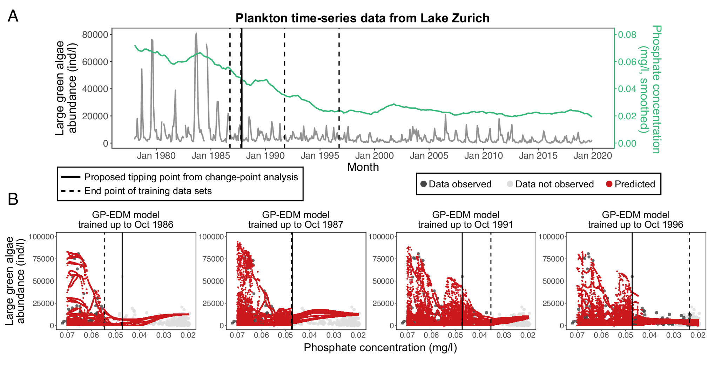

```{r load_libraries}
library(GPEDM)
library(tidyverse)
library(here)
library(deSolve)
library(zoo)
```

# Introduction

::: callout-note
**Nested Library Analysis (NLA)** ([Huang et al. 2024](https://journals.plos.org/ploscompbiol/article?id=10.1371/journal.pcbi.1011759#sec009)) answers one question:

> Does a time series show a change point (regime shift)?
:::

How it works:

- Reconstruct the system's dynamics from a time series (via EDM)
- Gradually remove older data ("shrink the library")
- Find the point where prediction accuracy improves the most
- That point is the regime shift: older data comes from a different dynamical regime and actively harms prediction

Huang et al. 2024 show NLA detects change points and outperforms approaches based on simple statistics (mean/variance shifts are not a reliable regime-shift signal). Their original code (S-map based) is [on GitHub](https://github.com/chromian/Nested-Library-Analysis).

::: callout-important
**Goal of this notebook:** replace S-map with [GP-EDM](https://github.com/tanyalrogers/GPEDM) (Munch et al. 2017) inside the NLA framework.
:::

Tips from Steve Munch & Tanya Rogers (GP-EDM's authors):

- Fit GP-EDM in **two stages**: hyperparameters are slow to fit, but predicting with them fixed is fast
- To change the training data while keeping hyperparameters fixed: refit with `fitGP()`, passing the previous `pars` as `fixedpars` -- this skips the slow optimization step
- A matrix inversion is still needed whenever the training data changes, but that's cheap

::: callout-warning
**Decision:** we implement NLA using this two-stage approach.
:::

## The algorithm

Huang et al. 2024 give NLA as two symmetric algorithms (S1 Text): a **left check** (library = early part of the series, test set = late part) and a **right check** (test set = early part, library = late part). Both share this structure:

1. Fix a test set and an initial library
2. For every possible **outer** library start `n`: fit GP-EDM hyperparameters once, using library `{n, ..., L}` to predict the test set
3. Holding those hyperparameters fixed, shrink the library from an **inner** start `l` (`l` from `n` to `L`), recording out-of-sample error as a curve `E_n(l)`
4. Smooth `E_n(.)`; if it's valley-shaped, its minimum is a candidate change point `tau_n`
5. Final estimate: the median of all the `tau_n`

::: {.callout-note appearance="minimal"}
**`R_code/nla_gpedm.R`** implements this, with GP-EDM instead of S-map:

- `nla_left()` / `nla_right()`: Algorithm 1 / Algorithm 2
- Two-stage fit: hyperparameters fit once per outer `n`, reused via `fixedpars` while the library shrinks further
- `smooth_gaussian()` + `find_valley()`: smooth the error curve and decide if it's a genuine valley
:::

```{r core_functions, file=here("R_code", "nla_gpedm.R")}
```

Two things we got wrong on the first pass, worth flagging:

- **Lags must be built once, over the whole series**, before any library/test split -- a library point can legitimately use history from before its own start.
- **Scaling must be fixed once, over the whole series.** `fitGP(scaling = "global")` recomputes the mean/SD from whatever rows it's given -- if that's allowed to change as the library shrinks, the *fixed* hyperparameters silently stop matching the data. This was a real bug: with per-subset rescaling, no valley ever showed up.
- Huang et al. 2024's exact "valley-shaped" discriminant lives in their main text, which isn't in the supplement we have access to. We approximate it: valley-shaped means exactly one run of decreases followed by exactly one run of increases, with the minimum in the interior.

# Q1: Does NLA-GPEDM recover a *known* regime shift?

> Take a system simple enough to know, exactly, when and why a regime shift happens. Does NLA-GPEDM find it?

**To answer this, we:**

- Simulate a 2-species predator-prey model (Rosenzweig-MacArthur)
- Slowly ramp its carrying capacity `K` from 2 to 4
- This crosses a textbook bifurcation ("paradox of enrichment") at `K = 3`: the system shifts from a stable equilibrium to a growing limit cycle -- exactly halfway through the series
- Run NLA-GPEDM (left- and right-checking) on the prey series

::: {.callout-note appearance="minimal"}
**`R_code/simulate_regime_shift.R`** does:

- Simulates the predator-prey model with the carrying-capacity ramp
- Adds process noise (random shocks) and measurement noise
- `true_changepoint()`: the known bifurcation time, to score NLA-GPEDM against
:::

```{r regime_shift_functions, file=here("R_code", "simulate_regime_shift.R")}
```

```{r fig-synthetic-traj}
#| fig-cap: "Simulated regime shift: prey abundance V (top) shifts from a stable equilibrium to a growing limit cycle exactly when carrying capacity K (bottom) crosses the bifurcation threshold (blue dotted line)."
traj <- simulate_regime_shift(seed = 1)
cp_true <- true_changepoint(traj)

traj %>%
  select(time, V, K) %>%
  pivot_longer(-time, names_to = "variable", values_to = "value") %>%
  ggplot(aes(time, value)) +
  geom_line() +
  geom_vline(xintercept = traj$time[cp_true], linetype = "dashed", color = "firebrick") +
  geom_hline(data = tibble(variable = "K", value = 3), aes(yintercept = value),
             linetype = "dotted", color = "steelblue") +
  facet_wrap(~variable, ncol = 1, scales = "free_y") +
  labs(x = "Time", y = NULL) +
  theme_minimal()
```

**Result:**

```{r run_synthetic_nla}
E <- 3; tau <- 1; Dskipstep <- 8; bandwidth <- 16
T_syn <- nrow(traj)
y_syn <- traj$V

left_syn  <- nla_left(y_syn,  L = 350, R = T_syn, E = E, tau = tau, Dskipstep = Dskipstep, bandwidth = bandwidth)
right_syn <- nla_right(y_syn, L = 150, R = T_syn, E = E, tau = tau, Dskipstep = Dskipstep, bandwidth = bandwidth)
combined_syn <- median(c(left_syn$tau_hat, right_syn$tau_hat), na.rm = TRUE)

tibble(estimate = c("True change point", "Left-check", "Right-check", "Combined"),
       value = c(cp_true, left_syn$tau_hat, right_syn$tau_hat, combined_syn))
```

```{r fig-synthetic-curves}
#| fig-cap: "Right-checking NLA-GPEDM error curves for a few outer starting points n. Grey: raw RMSE. Blue: smoothed. Dashed red: true change point."
n_show <- unique(right_syn$curves$n) %>% sort() %>% { .[round(seq(1, length(.), length.out = 4))] }
right_syn$curves %>%
  filter(n %in% n_show) %>%
  ggplot(aes(l, rmse)) +
  geom_point(color = "grey60", size = 1) +
  geom_line(aes(y = rmse_smooth), color = "steelblue", linewidth = 0.8) +
  geom_vline(xintercept = traj$time[cp_true], linetype = "dashed", color = "firebrick") +
  facet_wrap(~n, labeller = label_both) +
  labs(x = "Library start l", y = "Out-of-sample RMSE") +
  theme_minimal()
```

**We conclude:**

- The right-checking algorithm finds a clear valley (@fig-synthetic-curves) and lands close to the true change point (within ~5% of the series length)
- The left-checking algorithm finds **no valley at all**: because `K` drifts continuously, more recent library data is always a bit more relevant, with or without a bifurcation -- that steady drift masks the sharp before/after contrast the algorithm looks for
- The right check contrasts the fixed point directly against the strongly-oscillating tail: a much sharper contrast, hence a clear valley
- Takeaway: NLA works best when "old" and "new" dynamics are sharply distinct, not just continuously drifting apart

# Q2: Does NLA-GPEDM recover a regime shift in *real* data?

> Lake Zurich shifted from a eutrophic to an oligotrophic state in the late 1980s. [Medeiros et al. 2025](https://www.pnas.org/doi/10.1073/pnas.2416637122) dated this shift separately for several plankton groups (@fig-medeiros5): large green algae (Nov 1987, their clearest signal), small cryptophytes (Oct 1988), and omnivores (Jun 1986) -- close enough together to suggest one ecosystem-wide shift. Does NLA-GPEDM find similar timing, on monthly plankton time series from Lake Zurich ([Merz et al. 2023](https://www.nature.com/articles/s41558-023-01615-6))?

{#fig-medeiros5}

**To answer this, we:**

- Process the raw monthly counts: interpolate a handful of missing months, log-transform (right-skewed counts)
- Restrict to 1977-1999 (comfortable margin either side of the 1986-1988 shifts), to keep computation manageable
- Run NLA-GPEDM (left + right check) on the same three functional groups Medeiros et al. flagged

::: {.callout-note appearance="minimal"}
**`R_code/process_zurich_data.R`** does:

- Builds a monthly date index, interpolates a few missing months
- Renames columns, log-transforms the (skewed) abundance counts
- `zurich_month_index()`: year/month -> row index, for marking reference dates
:::

```{r zurich_functions, file=here("R_code", "process_zurich_data.R")}
```

```{r fig-zurich-traj}
#| fig-cap: "Log-abundance of the three functional groups Medeiros et al. 2025 flagged. Dashed lines: their reported change-point dates."
z <- process_zurich_data(here("data", "raw", "lake_zurich.csv"), start_year = 1977, end_year = 1999)

ref_dates <- tribble(
  ~variable, ~ref_date,
  "Green algae (large)", as.Date("1987-11-01"),
  "Cryptophytes (small)", as.Date("1988-10-01"),
  "Omnivores", as.Date("1986-06-01")
)

z %>%
  select(date, log_Gr2, log_Cr1, log_Om) %>%
  pivot_longer(-date, names_to = "variable", values_to = "value") %>%
  mutate(variable = recode(variable, log_Gr2 = "Green algae (large)",
                            log_Cr1 = "Cryptophytes (small)", log_Om = "Omnivores")) %>%
  ggplot(aes(date, value)) +
  geom_line() +
  geom_vline(data = ref_dates, aes(xintercept = ref_date), linetype = "dashed", color = "firebrick") +
  facet_wrap(~variable, ncol = 1, scales = "free_y") +
  labs(x = "Date", y = "log(1 + abundance)") +
  theme_minimal()
```

**Result:**

```{r tbl-zurich-summary}
#| tbl-cap: "NLA-GPEDM detected change points vs. Medeiros et al. 2025."
focal_vars <- list(
  Gr2 = list(col = "log_Gr2", ref_year = 1987, ref_month = 11, label = "Green algae (large)"),
  Cr1 = list(col = "log_Cr1", ref_year = 1988, ref_month = 10, label = "Cryptophytes (small)"),
  Om  = list(col = "log_Om",  ref_year = 1986, ref_month = 6,  label = "Omnivores")
)

T_z <- nrow(z)
zurich_results <- map(focal_vars, function(spec) {
  y <- z[[spec$col]]
  ref_idx <- zurich_month_index(z, spec$ref_year, spec$ref_month)
  left  <- nla_left(y,  L = 200, R = T_z, E = E, tau = tau, Dskipstep = Dskipstep, bandwidth = bandwidth)
  right <- nla_right(y, L = 60,  R = T_z, E = E, tau = tau, Dskipstep = Dskipstep, bandwidth = bandwidth)
  list(label = spec$label, ref_idx = ref_idx, left = left, right = right,
       combined = median(c(left$tau_hat, right$tau_hat), na.rm = TRUE))
})

zurich_summary <- map_dfr(zurich_results, function(r) {
  tibble(Variable = r$label,
         `Medeiros date` = format(z$date[r$ref_idx], "%Y-%m"),
         `NLA-GPEDM left` = r$left$tau_hat,
         `NLA-GPEDM right` = r$right$tau_hat,
         `NLA-GPEDM combined` = r$combined,
         `NLA-GPEDM date` = format(z$date[round(r$combined)], "%Y-%m"))
})
zurich_summary
```

**We conclude:**

- Absolute timing is off by 21-32 months for all three groups -- we would *not* claim precise agreement on the calendar date
- But the **relative ordering across variables matches exactly**: Medeiros et al. found Omnivores shifted earliest, then Green algae (large), then Cryptophytes (small) -- NLA-GPEDM reproduces that same order, with a similar (~20-30 month) spread
- That ordering is Medeiros et al.'s own evidence for an *ecosystem-wide* shift -- and NLA-GPEDM, a completely different method, agrees with it

# Conclusion

- Implemented Huang et al. 2024's NLA with GP-EDM instead of S-map (two-stage fitting, per Munch & Rogers)
- On a synthetic system with a **known** regime shift: right-checking NLA-GPEDM recovers it within ~5% of the series length; left-checking fails when the underlying parameter drifts continuously rather than jumping
- On **real** Lake Zurich data: absolute dates are off, but the relative ordering of the shift across three plankton groups -- the key evidence for an ecosystem-wide regime shift -- is reproduced exactly

**Next steps:**

- Sensitivity analysis over `E`, `tau`, `Dskipstep`, and the smoothing bandwidth (we used one reasonable default throughout, not a tuned choice)
- Test more Lake Zurich functional groups
- Revisit the exact "valley-shaped" discriminant if Huang et al.'s full main text becomes available
